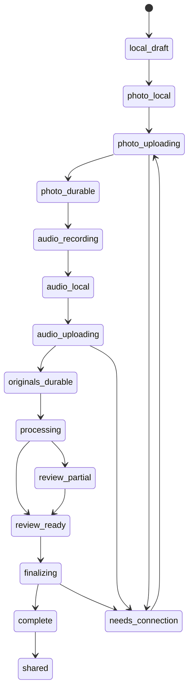
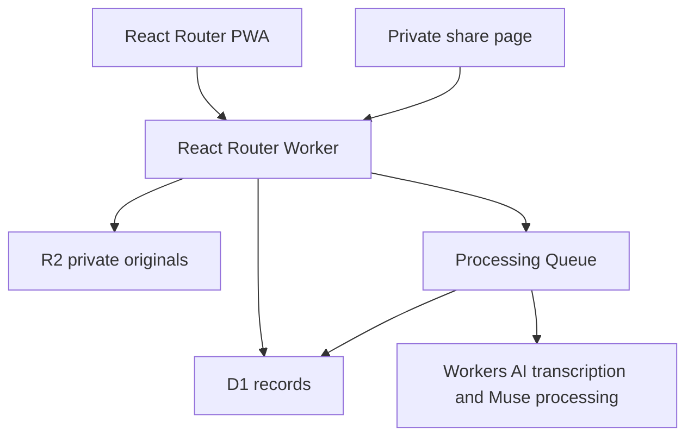

# Memories: My Story

## Phase 1 — Cloudflare-Native Solo Memory Story Build Specification

**Version:** 1.0  
**Date:** 2026-07-15  
**Status:** Implementation-ready baseline for approval  
**Canonical repository:** `sanlorenzoprx/memoriesmystory`  
**Local repository:** `C:\repos\memoriesmystory`  
**Technical application name:** `memoriesmystory`  
**Canonical destination:** `docs/IMPLEMENTATION/PHASE_1_SOLO_MEMORY_STORY_BUILD_SPEC.md`

---

## 1. Purpose

Build the first complete **Capture Your Memories** experience as a mobile-first Progressive Web App on Cloudflare.

The result is not a camera demo, transcription demo, AI demo, or collection of partially connected components. It is one truthful, durable user outcome:

> A person captures or imports one photograph, tells its story in their real voice, receives restrained help from Muse, reviews what was preserved, sees truthful confirmation that the originals are safe, opens the completed Memory Story, and can deliberately share it to unlock the next free Memory Story.

The emotional contract is:

**A photograph matters → my voice matters → I can do this → the memory is safe → my family can receive it.**

Phase 1 is complete only when this outcome works end to end on a representative phone-sized viewport, with recovery from interruption and evidence for every affected Product Invariant.

---

## 2. Binding sources and precedence

Implementation must read and obey these documents in order:

1. `docs/FOUNDATION/00_FOUNDING_PRINCIPLES.md`
2. `docs/FOUNDATION/01_PRODUCT_INVARIANTS.md`
3. `docs/FOUNDATION/99_THE_SOUL_OF_memoriesmystory.md`
4. `docs/FOUNDATION/02_PRODUCT_VISION.md`
5. `docs/FOUNDATION/03_USER_EXPERIENCE.md`, Version 1.1
6. `docs/FOUNDATION/04_TECHNICAL_PRINCIPLES.md`
7. `docs/PRODUCT/GOOD_KARMA_SHARE_POLICY_V1.md`
8. `docs/ARCHITECTURE/FOUNDATION_STACK.md`
9. This Phase 1 specification

When this specification conflicts with a higher-ranked source, the higher-ranked source wins and the conflict must be recorded. Implementation begins from the fresh repository and must not inherit unstated migrations, providers, business rules, or architecture.

---

## 3. Phase 1 product boundary

### 3.1 In scope

- Mobile-first React Router PWA entry.
- Brief, replayable **Capture Your Memories** guidance.
- Just-in-time camera and microphone permissions.
- Photograph capture from a physical print.
- Digital photograph import.
- Visual image-quality guidance for glare, shadow, focus, edges, and stability.
- Manual capture and manual acceptance after an honest quality warning.
- Optional automatic capture after stable quality thresholds.
- Immediate local draft recovery.
- Immutable original image upload to R2.
- Up to the centrally configured free voice allowance; launch value is 30 seconds.
- Immutable original audio upload to R2.
- Workers AI Whisper-class transcription through a real, replaceable transcription boundary.
- Mixed English and Spanish handling without forcing a language choice before listening.
- One useful Muse prompt at a time.
- Muse Legacy Description stored separately from testimony.
- Suggested people, place, date, event, and other tags with explicit truth states.
- Transcript and metadata correction without changing the original audio.
- Truthful durable-save confirmation.
- Completed Memory Story playback and return path.
- Just-in-time email, Google, and Facebook account paths needed for ownership and recovery.
- Minimum Good Karma share path: private tokenized page, copy link, native share handoff, qualifying event, and unlock of the next free Memory Story.
- English and Spanish message catalogs with BCP 47 locale behavior.
- Accessibility, interruption recovery, security, observability, and invariant evidence.

### 3.2 Explicitly deferred from Phase 1

- Memory Albums beyond a future-safe optional association field.
- In-person multi-speaker Memory Circles.
- Remote WebRTC Memory Circles.
- Durable Objects for live rooms.
- Full public global feed.
- Ranking, recommendation, moderation, and public discovery systems.
- Direct Instagram or Facebook publishing beyond the minimum supported browser/native handoff.
- Video reels.
- Billing and paid tiers.
- Archive-wide semantic search and Vectorize.
- On-device transcription.
- Legacy custodian UI.
- Full archive export UI.
- Large provider registry or speculative fallback framework.

These remain first-release or later-foundation obligations where specified. Deferral from Phase 1 is not cancellation.

### 3.3 No false completion

The following do not complete Phase 1 by themselves:

- a successful build;
- a working camera component;
- an R2 upload;
- an AI transcript;
- isolated API routes;
- passing unit tests;
- mock-provider output;
- a memory card rendered from fixtures;
- code merged without phone-sized end-to-end evidence.

---

## 4. Reconciliation decision: sharing belongs in the minimum Phase 1 slice

Foundation v1.1 contains two statements that need an explicit implementation interpretation:

- The binding first-five-minute acceptance contract requires a deliberate qualifying share to unlock the next free Memory Story.
- The earlier build-order guide placed sharing and Good Karma entitlements in Phase 3.

The Foundation precedence rule makes the acceptance contract and Product Invariant I-24 controlling. Therefore:

- **Phase 1 implements the minimum share-and-unlock path required to prove the first-use promise.**
- **Phase 3 expands sharing** with albums, richer channel coverage, broader direct publishing, social assets, public discovery, and scaled operations.

Phase 1 sharing is intentionally narrow but real. A copied private link qualifies. Recipient-open verification and proof of external publication are not required in V1.

After this specification is approved, `08_BUILD_ORDER.md` should be clarified so future builders do not reintroduce the conflict.

---

## 5. User experience flow

The time ranges are design targets, not restrictions imposed on a person.

| Target time | User experience | Required system truth |
| --- | --- | --- |
| 0:00–0:30 | Understand why this matters and choose **Capture a Memory**. | No account tour, model language, pricing wall, or batch permission prompt. |
| 0:30–1:30 | Capture a physical photograph or import a digital one. | Original remains local until durable upload; guidance is helpful and overridable. |
| 1:30–2:30 | Hear **Would you like help remembering?** and begin speaking. | Microphone requested in context; recording limit comes from centralized entitlement configuration. |
| 2:30–3:30 | Muse listens and, only when useful, asks one warm question. | Silence, uncertainty, emotion, and mixed English/Spanish are accepted. |
| 3:30–4:30 | Review the photograph, original voice, transcript, Muse Legacy Description, and suggested facts. | Human, corrected, uncertain, and generated material remain distinguishable. |
| 4:30–5:00 | Receive durable confirmation, open the Memory Story, and choose whether to share. | Locked completion copy appears only after required originals and ownership metadata are durable. |

### 5.1 First screen

Required content:

- Product purpose in one sentence.
- Primary action: **Capture a Memory**.
- Secondary path to sign in for a returning user.
- Language control that does not block automatic language behavior.

Do not lead with AI, storage architecture, feature lists, pricing, or a multi-step registration form.

### 5.2 Contextual permissions

- Request camera access when the user chooses camera capture.
- Request microphone access when the user chooses to record.
- Explain each request in plain language before the browser prompt.
- Never request camera and microphone together merely for convenience.
- Denial must reveal import, retry, and settings-help paths without losing progress.

### 5.3 First-few-use guidance

- Repeat capture guidance during the first few uses.
- Make every guidance step skippable.
- Reduce guidance as completion confidence grows.
- Keep full guidance replayable through **Muse Help**.
- Do not infer ability from age, language, or device.

### 5.4 Identity timing

The user may begin locally without completing a profile.

When server-side ownership becomes necessary:

1. Preserve the current local draft.
2. Explain that an account protects recovery and family access.
3. Offer email, Google, and Facebook.
4. Resume the exact interrupted step after success.
5. Preserve local progress after cancellation or network failure.

An implementation may use a narrowly scoped anonymous draft session before account binding. It must not expose assets publicly, grant archive access, or become a hidden permanent account.

### 5.5 Completion and sharing

Once required original assets and ownership metadata are durably confirmed, show exactly:

**This memory is now part of your family's history.**

Then offer:

1. **Share this Memory Story**
2. **View my Memory Story**

Supporting Good Karma message:

**Share a memory. Preserve another.**

The story just completed remains preserved even if the user does not share. Sharing unlocks the next free story and may be completed later.

---

## 6. Client state machine

The capture experience uses an explicit recoverable state machine. UI labels may be friendlier, but stored state must remain unambiguous.



### State rules

- `photo_local` and `audio_local` must survive route changes and browser restart where platform storage allows.
- `photo_durable` and `originals_durable` require R2 confirmation plus D1 asset records.
- `processing` never implies that the originals are unsafe.
- AI failure moves to `review_partial`, not data loss.
- `complete` requires the completion transaction described below.
- `shared` requires a qualifying event receipt, not recipient-open verification.
- Every mutating transition uses an idempotency key.

---

## 7. Cloudflare-native runtime design

### 7.1 Runtime topology



### 7.2 Phase 1 bindings

Required bindings:

- `DB`: Cloudflare D1.
- `MEDIA_BUCKET`: private Cloudflare R2 bucket.
- `AI`: Cloudflare Workers AI.
- `PROCESSING_QUEUE`: Cloudflare Queue for transcription and Muse jobs.
- `SESSION_SECRET`: secret used for signed sessions or secure session state.

Technical resource names follow the application identity standard:

- npm package: `memoriesmystory`
- internal package scope: `@memoriesmystory/*`
- Cloudflare Worker: `memoriesmystory`
- D1 database: `memoriesmystory`
- R2 bucket: `memoriesmystory-media`
- processing queue: `memoriesmystory-processing`
- PWA short name: `memoriesmystory`

Bindings such as `DB`, `MEDIA_BUCKET`, `AI`, and `PROCESSING_QUEUE` remain uppercase code identifiers; the deployed resource names use the `memoriesmystory` application name.

Configuration, not duplicated constants:

- `FREE_STORY_LIMIT=5`
- `FREE_VOICE_SECONDS=30`
- `MAX_IMAGE_BYTES`
- `MAX_AUDIO_BYTES`
- supported MIME types;
- guest-draft retention;
- completed-story recovery retention;
- locale defaults;
- model identifiers;
- prompt versions;
- share-token lifetime and visibility policy.

Production values that affect privacy or deletion require an explicit decision or legal review before launch.

### 7.3 Boundaries deliberately not used in Phase 1

- No Durable Object: the solo flow has no live multi-participant room state.
- No WebRTC/SFU: remote Memory Circles are deferred.
- No Vectorize: D1 retrieval is sufficient.
- No Hono layer: React Router loaders, actions, and resource routes can own the Phase 1 application API.
- No Workflow unless queue evidence proves a single durable queue job is insufficient.

This follows the rule that new wrappers, controllers, and providers require current evidence.

---

## 8. React Router application map

Exact filenames may follow the selected React Router flat-route convention, but the responsibilities must remain clear.

| Route | Loader responsibility | Action/resource responsibility |
| --- | --- | --- |
| `/` | Locale, returning-session state, current entitlement summary. | Start a local/server draft only after the user acts. |
| `/capture/:draftId` | Recover draft state and durable receipts. | Advance capture steps; never accept a false client-only completion claim. |
| `/resources/drafts/:draftId/photo` | None. | Validate and stream an original image to R2; record hash, size, and durable receipt in D1. |
| `/resources/drafts/:draftId/audio` | None. | Validate and stream original audio to R2; record hash, size, duration, and durable receipt. |
| `/resources/drafts/:draftId/process` | Current processing status. | Enqueue idempotent transcription/Muse processing when originals are durable. |
| `/resources/drafts/:draftId/finalize` | None. | Validate ownership and required assets; atomically create the completed Memory Story. |
| `/stories/:storyId` | Load the owner-visible completed Memory Story and current artifact states. | Save transcript revision, facts, or Muse-description edits as additive history. |
| `/stories/:storyId/share` | Load supported Phase 1 share choices. | Create a private share record and qualifying share-event receipt. |
| `/share/:token` | Load only the deliberately shared projection. | No archive mutation without authenticated, authorized action. |
| `/auth/*` | Resume target and draft binding state. | Email, Google, or Facebook authentication and secure draft promotion. |

### Route rules

- Prefer server loaders/actions and progressive enhancement.
- Use resource routes for binary streaming and narrow machine responses.
- No separate general-purpose REST API is required for Phase 1.
- Every state-changing action verifies session/draft ownership and CSRF protection.
- The browser never receives R2 credentials or private bucket keys.

---

## 9. Local-first and interruption recovery

### 9.1 Browser storage

Use IndexedDB for recoverable draft state and captured blobs. Store at minimum:

- local draft ID;
- server draft ID when assigned;
- current state;
- original image blob and checksum until durable;
- original audio blob and checksum until durable;
- upload attempt and idempotency keys;
- locale information;
- pending review edits;
- last confirmed server receipts.

Do not rely solely on Background Sync because support differs across browsers. Resume uploads from ordinary application startup and network-restored events.

### 9.2 Recovery behavior

- Reload returns to the last honest state.
- Offline capture remains local and clearly labeled.
- Failed upload retries the same asset identity; it does not create duplicate originals.
- Sign-in interruption preserves the local draft and resume target.
- Clearing local data before durable upload is an explicit risk and must never be described as saved.
- After durable confirmation, local media may be removed according to a documented safe cleanup rule.

---

## 10. Camera and archival image capture

### 10.1 Browser capabilities

Use progressive enhancement:

1. `getUserMedia` with the environment-facing camera when supported.
2. `ImageCapture` when available and reliable.
3. Video-frame canvas capture as a fallback.
4. File input/import as a universal fallback.

### 10.2 Quality guidance

Evaluate, when device capacity allows:

- focus/sharpness;
- glare and clipped highlights;
- heavy shadow;
- photograph boundary detection;
- perspective/skew;
- stability across consecutive frames;
- minimum usable resolution.

OpenCV.js/Wasm may be loaded only after capability qualification. Lower-powered devices must retain a useful browser-native path.

### 10.3 Capture rules

- Show one corrective instruction at a time.
- Never hide manual capture.
- Permit manual acceptance after a clear quality warning.
- Optional automatic capture requires stable quality across consecutive frames and an obvious cancel path.
- Preserve the captured/imported original without destructive transforms.
- Orientation normalization, crop, perspective correction, denoise, or color repair creates a derivative asset with provenance.
- Original EXIF may be retained privately when lawful and useful; public delivery derivatives must not expose unnecessary location metadata.

---

## 11. Audio capture and original voice

### 11.1 Recording

- Use `MediaRecorder` with runtime MIME negotiation.
- Provide visible recording state, elapsed time, pause/stop where supported, and accessible spoken/visual cues.
- Enforce the centrally configured allowance in both client behavior and server validation.
- The launch free allowance is 30 seconds.
- A gentle countdown must not interrupt the emotional moment.
- Allow playback before finalization.
- Allow rerecording only through an explicit choice; never overwrite a previously durable original in place.

### 11.2 Muse prompt timing

The user first chooses whether help is wanted.

- If yes, Muse may offer one starter question before recording.
- Muse may offer one relevant follow-up after transcription when it materially improves the story.
- Any additional recorded answer uses the remaining configured voice allowance unless entitlement permits more.
- No rapid who/what/when/where interrogation.
- Silence and **I don't remember** are valid outcomes.

### 11.3 Audio provenance

Store:

- original MIME type;
- byte size;
- duration;
- SHA-256 checksum;
- capture timestamp;
- uploader/account/draft identity;
- R2 object key and entity tag;
- derivation relationship for any cleaned audio.

---

## 12. Transcription and Muse processing

### 12.1 Transcription

- Process only after the original audio is durably stored.
- Queue one idempotent job keyed by audio asset and transcription version.
- Use the Cloudflare Workers AI binding with the launch-selected Whisper-class model.
- Keep model identifiers in configuration and verify current Cloudflare availability during implementation.
- Preserve detected language and uncertainty.
- Mixed English and Spanish must not be flattened into one forced language.
- A provider failure cannot replace the transcript with placeholder text in a user-visible environment.
- Retry within a bounded policy; otherwise show **Processing** or **Needs attention** and preserve the story originals.

### 12.2 Transcript history

Maintain separate records for:

- machine transcript version;
- user-corrected revision;
- optional translated transcript;
- revision author, time, and source version.

The current display revision may change. The original audio and prior transcript history do not.

### 12.3 Muse Legacy Description

- Generated only from available testimony and explicitly accepted metadata.
- Stored as a generated artifact, never as the transcript.
- Carries prompt version, model configuration, input references, creation time, and status.
- Clearly labeled and editable.
- Never invents names, dates, places, relationships, motives, or consensus.
- May remain pending without blocking preservation of the originals.

### 12.4 Muse prompt generation

The prompt system receives the transcript, accepted facts, unknown fields, locale, and previous Muse question. It returns either:

- one warm question; or
- no question.

Returning no question is correct when the story is already sufficient or the user has declined help.

Do not build a large provider registry in Phase 1. Create a narrow transcription boundary because a higher-quality fallback is an approved requirement. Keep Muse model invocation behind a small domain service with versioned prompts; add another provider abstraction only when a real second provider is selected.

---

## 13. Phase 1 domain model

### 13.1 Core types

```ts
type DraftStatus =
  | "local_draft"
  | "photo_local"
  | "photo_uploading"
  | "photo_durable"
  | "audio_recording"
  | "audio_local"
  | "audio_uploading"
  | "originals_durable"
  | "processing"
  | "review_partial"
  | "review_ready"
  | "finalizing"
  | "complete"
  | "needs_connection";

type AssetRole =
  | "original_photo"
  | "enhanced_photo"
  | "original_audio"
  | "cleaned_audio";

type TruthState =
  | "confirmed"
  | "approximate"
  | "unknown"
  | "disputed"
  | "ai_suggested_unconfirmed";

type FactKind =
  | "person"
  | "place"
  | "date"
  | "event"
  | "relationship"
  | "theme";

type ArtifactKind =
  | "machine_transcript"
  | "corrected_transcript"
  | "translated_transcript"
  | "muse_legacy_description"
  | "muse_prompt";
```

### 13.2 Memory Story completion requirements

A completed Phase 1 Memory Story requires:

- owner account/archive identity;
- immutable original photograph asset marked durable;
- immutable original audio asset marked durable;
- story ID and additive history record;
- truthful completion timestamp;
- current visibility, defaulting to private.

Transcription, Muse description, tags, and image enhancement may remain processing or unavailable. Their failure must not erase or falsely invalidate durably preserved originals. The UI must make partial processing truthful.

### 13.3 Suggested D1 tables

Use additive migrations and foreign keys where Cloudflare D1 behavior supports them.

#### `users`

- `id`
- `email`
- `created_at`
- `updated_at`

#### `user_identities`

- `id`
- `user_id`
- `provider` (`email`, `google`, `facebook`)
- `provider_subject`
- `created_at`
- unique provider/subject constraint

#### `user_sessions`

- `id`
- `user_id`
- signed-token/session lookup fields
- `expires_at`
- `revoked_at`
- `created_at`

#### `memory_story_drafts`

- `id`
- nullable `owner_user_id` before promotion
- scoped anonymous draft identity hash where used
- `status`
- `ui_locale`
- `spoken_locale`
- `created_at`
- `updated_at`
- `expires_at`
- `version`

#### `memory_stories`

- `id`
- `owner_user_id`
- `status`
- `visibility`
- `primary_photo_asset_id`
- `primary_audio_asset_id`
- nullable current transcript revision ID
- nullable current Muse description ID
- `created_at`
- `completed_at`
- `updated_at`
- `version`

#### `media_assets`

- `id`
- `draft_id`
- nullable `memory_story_id`
- `role`
- `source_asset_id` for derivatives
- private `r2_key`
- `content_type`
- `byte_size`
- `duration_ms` where applicable
- `sha256`
- `r2_etag`
- `durability_status`
- `created_by_user_id`
- `created_at`

No update may change an original asset's bytes, role, checksum, or R2 key.

#### `transcript_revisions`

- `id`
- `memory_story_id`
- `source_audio_asset_id`
- nullable `parent_revision_id`
- `revision_kind`
- `text`
- `locale`
- `created_by_type` (`machine`, `user`, `translator`)
- nullable `created_by_user_id`
- model/prompt version where machine-created
- `created_at`

#### `generated_artifacts`

- `id`
- `memory_story_id`
- `kind`
- `content`
- `status`
- `source_refs_json`
- `model_config_version`
- `prompt_version`
- `created_at`
- `updated_at`

#### `memory_story_facts`

- `id`
- `memory_story_id`
- `kind`
- `value`
- `truth_state`
- `source_type`
- nullable `source_ref`
- nullable `confirmed_by_user_id`
- `created_at`
- nullable `superseded_at`

#### `story_entitlements`

- `user_id`
- `plan`
- `free_story_limit`
- `free_stories_unlocked`
- `free_stories_completed`
- purchased/paid capacity fields reserved without Phase 1 billing logic
- `updated_at`

Launch behavior:

- `free_story_limit = 5`
- `free_stories_unlocked = 1` at account creation
- story creation allowed when completed is lower than unlocked
- one qualifying share for the current completed free story increments unlocked, capped at five

#### `memory_story_shares`

- `id`
- `memory_story_id`
- `owner_user_id`
- `token_hash`
- `visibility`
- `revoked_at`
- `created_at`
- `updated_at`

Store a hash of the external share token when practical. The public loader returns only the deliberately shared projection.

#### `share_events`

- `id`
- `share_id`
- `memory_story_id`
- `account_id`
- `channel`
- `action`
- `occurred_at`
- `unlock_granted`
- `application_version`
- nullable `cancelled_at`
- idempotency constraint preventing duplicate unlocks

#### `agreement_acceptances`

- `id`
- nullable `user_id`
- `draft_id`
- `agreement_kind`
- `agreement_version`
- `context`
- `accepted_at`

#### `operation_receipts`

- `idempotency_key`
- `operation_kind`
- scoped owner/draft/story ID
- `request_hash`
- `status`
- `result_ref`
- `created_at`
- `updated_at`

---

## 14. R2 object model and durability

### 14.1 Private object keys

Use immutable, identity-based keys. Example:

```text
accounts/{accountId}/memory-stories/{storyId}/assets/{assetId}/original.{ext}
accounts/{accountId}/memory-stories/{storyId}/assets/{assetId}/derivatives/{derivativeId}.{ext}
drafts/{draftId}/assets/{assetId}/original.{ext}
```

Do not use a stable filename that is overwritten when a user rerecords or reprocesses an image.

### 14.2 Durable receipt

An asset is durable only after:

1. the Worker validates the upload;
2. R2 accepts the full object;
3. size, checksum, object key, and R2 entity tag are recorded in D1;
4. the action returns a server-generated durable receipt;
5. a later loader can independently retrieve the record.

The finalization transaction verifies both required original asset receipts. The client cannot promote its own optimistic state to `complete`.

### 14.3 Access

- R2 bucket remains private.
- Owner playback uses authorized streaming/resource routes or short-lived signed access.
- Shared pages use a deliberately shared projection and revocable share record.
- Range requests should be supported for audio playback where practical.
- Delivery derivatives may be cached; originals require stronger privacy controls.

---

## 15. Completion transaction

`finalize` must be idempotent and fail closed.

Within one logical operation:

1. Verify authenticated owner or securely promoted draft identity.
2. Verify entitlement allows the current story.
3. Verify durable original photograph asset.
4. Verify durable original audio asset.
5. Create or load the stable Memory Story ID.
6. Bind the original assets to the Memory Story without changing their identity.
7. Mark the story complete and private by default.
8. Increment `free_stories_completed` once.
9. Append an auditable completion event/receipt.
10. Return the story ID, completion timestamp, and locked completion message.

If the response is lost, retry with the same idempotency key and return the same successful result. Never create a second story or consume a second entitlement.

---

## 16. Minimum Good Karma share and unlock

### 16.1 Qualifying Phase 1 actions

- copy private link;
- invoke native/browser share and select or initiate a destination where observable;
- provider handoff initiated;
- direct publication completed if supported;
- public-feed publication completed when that later surface exists.

Recipient-open proof is not required.

### 16.2 Unlock transaction

The share action must:

1. Verify the owner and completed Memory Story.
2. Create or reuse a revocable share record.
3. Record the qualifying intent event.
4. Determine whether this story/account has already granted the next free unlock.
5. Increment `free_stories_unlocked` once, capped at five.
6. Return an entitlement receipt and user-facing confirmation.

Concurrent or repeated actions must not grant multiple unlocks.

### 16.3 Privacy

- Private is the default.
- Copying a private link qualifies.
- Public sharing is never assumed.
- The user sees the selected audience before handoff.
- A share can be revoked without deleting the Memory Story.
- Shared projection excludes private metadata, raw provenance records, account identifiers, and unapproved facts.

---

## 17. Authentication and account binding

### 17.1 Supported methods

- Email sign-in/verification.
- Google OAuth/OIDC.
- Facebook Login.

The implementation may ship email first during development, but Phase 1 production acceptance requires the account paths approved for launch or an explicit decision that schedules a named path before public release.

### 17.2 Session requirements

- Secure, HTTP-only cookies.
- `Secure` in deployed environments.
- SameSite policy appropriate to OAuth callbacks.
- Rotation/revocation support.
- Server-side session verification on every protected action.
- CSRF protection for state-changing form/actions.
- No consumer authentication through Cloudflare Access.

### 17.3 Draft promotion

Draft promotion is idempotent:

- validates anonymous draft credential;
- binds the draft and assets to the authenticated account;
- rotates the draft credential;
- prevents another account from claiming the draft;
- resumes the stored route/state;
- records agreement versions and promotion receipt.

---

## 18. Security and privacy baseline

- Validate file signatures, not only extensions or client MIME claims.
- Reject unsupported formats and centrally configured size limits.
- Rate-limit draft creation, upload, transcription, authentication, and sharing.
- Keep R2 private.
- Use opaque, high-entropy share tokens; store hashed tokens when practical.
- Escape all transcript, metadata, and generated content on render.
- Apply Content Security Policy and secure headers.
- Keep secrets and model configuration server-side.
- Do not log raw audio, full transcripts, OAuth tokens, or share tokens.
- Log identifiers and bounded error details sufficient for repair.
- Preserve original metadata privately only when justified; strip unnecessary metadata from public derivatives.
- Version consent and AI-processing agreements.
- Treat deletion and retention as explicit future policy, never an ad hoc cleanup script.
- Verify Cloudflare provider data handling before production; do not claim privacy guarantees that have not been confirmed.

---

## 19. Accessibility and localization

### 19.1 Accessibility

- WCAG 2.2 AA target for the Phase 1 flow.
- Large touch targets and readable default typography.
- High contrast without relying on color alone.
- Full keyboard operation.
- Screen-reader names and state announcements.
- Visible focus.
- Captions/transcript as additive access to voice.
- Spoken guidance can be replayed and muted.
- No essential action depends on a short timeout.
- Recording time entitlement is clear, but accessibility interaction time is not artificially constrained.
- Reduced-motion behavior.
- Error recovery returns focus to the relevant action.

### 19.2 Localization

- BCP 47 locale profiles.
- English and Spanish catalogs from the first implementation.
- Locale fallback such as `es-PR → es → default` and `en-US → en → default`.
- UI locale and spoken-language detection stored separately.
- Original spoken language is preserved.
- No concatenated English sentence fragments in components.
- RTL-ready tokens and layout even if an RTL catalog does not ship in Phase 1.

---

## 20. Observability and receipts

Every important operation emits a correlation ID and structured receipt.

Minimum events:

- draft created/recovered;
- permission denied/retried;
- photo captured/imported;
- photo upload started/completed/failed;
- audio recording completed;
- audio upload started/completed/failed;
- transcription queued/completed/failed;
- Muse artifact queued/completed/failed;
- account binding completed/failed;
- story finalization completed/failed;
- story opened after completion;
- share intent recorded/cancelled where observable;
- entitlement unlock granted/duplicate prevented.

Operational logs must answer:

- Were both originals durable?
- Which transition failed?
- Can the action be retried safely?
- Was an unlock granted exactly once?
- Did the user see a false completion state?

User-facing analytics must not become surveillance of intimate family content.

---

## 21. Testing strategy

### 21.1 Unit tests

- State-machine transitions and invalid transitions.
- Entitlement calculations and five-story cap.
- Share-event idempotency.
- Truth-state validation.
- Immutable asset rules.
- MIME/signature validation.
- Prompt-output schema and one-question maximum.
- Locale fallback.
- Completion message exactness.
- Configuration loading without duplicated business values.

### 21.2 Integration tests

Run against local Cloudflare-compatible D1/R2/Queue bindings:

- resumable/idempotent photo upload;
- resumable/idempotent audio upload;
- checksum and durable-receipt persistence;
- queue retry without duplicate transcript/artifact;
- finalization fails without either original;
- finalization retry returns the original story;
- private share projection excludes private fields;
- copied link grants one unlock;
- repeated/concurrent share events do not grant another;
- story 5 cannot unlock story 6 under the free policy;
- account promotion cannot be claimed twice;
- transcript correction appends rather than overwrites history.

### 21.3 End-to-end tests

Use Playwright with representative phone viewports and both English and Spanish:

1. New user captures a physical-photo fixture.
2. Contextual camera permission appears.
3. User overrides or satisfies quality guidance.
4. Contextual microphone permission appears.
5. User records and plays back original voice.
6. Network interruption occurs before or during upload.
7. Reload/reconnect resumes the exact draft.
8. User completes account binding and returns to the draft.
9. Transcript/Muse output is reviewed with human/generated separation.
10. Locked completion sentence appears only after durable confirmation.
11. Completed Memory Story reopens from a new navigation session.
12. Copying a private link records a qualifying share and unlocks Memory Story 2.

Additional paths:

- denied camera → import fallback;
- denied microphone → retry/help without lost photograph;
- transcription failure → originals preserved and honest partial state;
- mixed English/Spanish recording;
- screen-reader and keyboard path;
- reduced-motion path;
- lower-powered/capability-limited camera path;
- duplicate finalization and duplicate share requests.

### 21.4 Live-provider staging gate

Mocks and fixtures are allowed in unit and deterministic integration tests. They are not allowed as the production fallback or evidence of live readiness.

Before Phase 1 acceptance:

- run at least one real Workers AI transcription through the deployed binding;
- verify an English recording;
- verify a Spanish or mixed English/Spanish recording;
- preserve the provider receipt, latency, model configuration, and result;
- prove that provider failure yields an honest recoverable state rather than placeholder content.

### 21.5 Real-device acceptance

At minimum verify:

- one current Android Chrome device;
- one current iPhone Safari device or explicitly recorded launch blocker;
- one lower-powered or constrained mobile profile;
- unreliable/transitioning network behavior;
- camera capture of a real physical print with glare and perspective challenges.

The product is a web application, but mobile browser behavior is part of the product contract.

---

## 22. Product Invariant release matrix

| Invariant | Phase 1 evidence |
| --- | --- |
| I-01 Original voice | R2 original audio receipt and completed-story playback. |
| I-02 Photograph + voice bound | Story record references immutable original photo and audio assets. |
| I-03 No editorial correction | Transcript correction is additive; original audio and machine revision remain. |
| I-04 Truth states | Suggested facts remain unconfirmed until accepted. |
| I-06 Immutable originals | Attempted mutation is rejected; derivative receives a new asset ID. |
| I-07 Additive history | Transcript, fact, agreement, share, and entitlement events retain attribution. |
| I-08 Saved means durable | Completion fails without both R2/D1 durable receipts. |
| I-11 Technology background | First screen and capture path avoid provider/model language. |
| I-12 Muse listens | Prompt tests prove zero or one relevant question. |
| I-13 Recoverable guidance | Muse Help is skippable, replayable, and repeats in early use. |
| I-14 Accessibility | Automated and manual phone-sized accessibility evidence. |
| I-15 Language adaptation | English/Spanish catalogs and mixed-language live test. |
| I-16 Family controls visibility | Private default and deliberate audience selection. |
| I-18 Generated distinction | Muse description and suggestions have separate labels and records. |
| I-20 Versioned agreements | Account/draft agreement receipt includes version and context. |
| I-21 Growth serves preservation | Share follows preservation and uses approved Good Karma copy. |
| I-22 Central limits | Five-story and 30-second rules loaded from configuration. |
| I-24 Share-to-unlock | One qualifying private share unlocks story 2 exactly once. |
| I-25 Locked promise | Exact sentence appears only after durable completion. |

Any failed row blocks Phase 1 acceptance.

---

## 23. Fresh repository implementation rule

`sanlorenzoprx/memoriesmystory` begins from this combined documentation package.

1. Create implementation only when required by the active build packet.
2. Do not import application code, schemas, migrations, provider layers, tests, or business rules from another codebase.
3. Do not create compatibility layers for systems that never existed in this repository.
4. Every new boundary must have a current Phase 1 requirement, an affected Product Invariant, and acceptance evidence.
5. Every schema starts from an ordered D1 migration in this repository.
6. Every Cloudflare binding starts from checked-in configuration and a deployment receipt in this repository.
7. Mock or fixture behavior is confined to tests and cannot become a user-visible fallback.
8. The first implementation target remains one complete solo Memory Story, not a broad platform scaffold.

---

## 24. Implementation sequence

Each build packet must end in a demonstrable user outcome and a receipt.

### Packet 0 — Fresh repository bootstrap

- Confirm the empty repository and default branch.
- Add this combined Foundation and implementation package.
- Create the first bounded implementation branch.
- Establish React Router v8 + TypeScript + Vite Worker scaffold.
- Add baseline lint, typecheck, unit-test, build, and CI commands.
- Add Cloudflare configuration with declared but unprovisioned bindings.
- Record the initial architecture and repository bootstrap decision.

**Exit evidence:** bootstrap commit, architecture-decision record, CI receipt, and clean build/typecheck/test baseline.

### Packet 1 — Domain, configuration, and persistence contracts

- Implement Phase 1 domain types.
- Centralize five-story and 30-second entitlements.
- Add D1 migrations and R2 key policy.
- Add idempotency receipts.

**Exit evidence:** schema tests, immutable-asset tests, entitlement tests, migration receipt.

### Packet 2 — Local-first capture and onboarding

- Build first screen and capture route.
- Implement contextual permissions.
- Implement IndexedDB draft recovery.
- Implement import and capability-qualified camera path.
- Implement quality guidance and manual override.

**Exit evidence:** phone viewport capture/import demo, reload recovery, camera-denial fallback, accessibility check.

### Packet 3 — Original media durability

- Stream photo/audio through resource routes.
- Validate signatures, sizes, hashes, ownership, and idempotency.
- Store private R2 originals and D1 receipts.
- Implement original audio recording and playback.

**Exit evidence:** interrupted upload recovery; both original receipts independently retrievable.

### Packet 4 — Account binding and recovery

- Implement scoped draft identity.
- Implement email and approved OAuth paths.
- Promote draft safely and resume state.
- Record agreement versions.

**Exit evidence:** interrupted sign-in preserves draft; double-claim and CSRF tests pass.

### Packet 5 — Transcription and Muse

- Add queue processing.
- Add real Workers AI transcription binding.
- Add transcript revision model.
- Add zero-or-one Muse question service.
- Add Muse Legacy Description with provenance.

**Exit evidence:** English and mixed/Spanish live provider receipts; failure leaves originals safe and visible.

### Packet 6 — Review and durable completion

- Build unified Memory Story review.
- Show human/generated/truth-state distinctions.
- Implement idempotent completion transaction.
- Show locked completion copy only after confirmation.
- Build owner playback and safe return path.

**Exit evidence:** completion retry creates one story, consumes one entitlement, and reopens after a new navigation session.

### Packet 7 — Minimum share-to-unlock

- Create revocable private share.
- Build public-token projection.
- Add copy link and native/browser handoff.
- Record qualifying intent.
- Grant exactly one unlock up to five.

**Exit evidence:** Story 2 unlocks after one copied link; duplicate/concurrent events do not double grant.

### Packet 8 — Full Phase 1 acceptance

- Complete English/Spanish and accessibility review.
- Run all failure/recovery paths.
- Run live-provider staging gate.
- Run real-device acceptance.
- Produce invariant matrix and release receipt.

**Exit evidence:** every Section 22 row passes; no known false-save or original-loss path.

---

## 25. Required implementation artifacts

Phase 1 must leave the canonical repository with:

- React Router Worker application source.
- Central runtime/entitlement configuration.
- D1 migrations and migration notes.
- R2 object-key and access policy.
- Queue consumer for processing.
- Versioned transcription and Muse prompt records.
- English and Spanish catalogs.
- Unit, integration, E2E, and live-provider tests.
- Real-device manual QA record.
- Security/privacy review record.
- Invariant evidence matrix.
- Deployment and rollback runbook.
- Phase 1 implementation receipt with exact commands, results, known limitations, deployed state, and next bounded task.

---

## 26. Explicit non-blocking decisions

These do not block starting Packets 0–3 because they remain configurable or later-scoped:

- exact paid plans and limits;
- final Memory Circle brand name;
- full direct-social publishing matrix;
- public-feed ranking depth;
- fallback transcription provider selection;
- on-device transcription thresholds;
- remote-circle video retention;
- final legal wording.

They must not be allowed to weaken a Product Invariant or block preservation of the first original photo and voice.

---

## 27. Phase 1 definition of done

Phase 1 is done when a first-time user can, on a real mobile browser:

1. understand the purpose;
2. capture/import a photograph with useful guidance;
3. record and replay their real voice;
4. survive an interruption without losing the draft;
5. receive truthful transcription and restrained Muse assistance—or an honest partial-processing state;
6. distinguish original testimony from corrections and generated material;
7. complete account ownership without losing progress;
8. receive durable confirmation only after the required originals are safe;
9. reopen the Memory Story later;
10. copy or share a private link and unlock Memory Story 2 exactly once;
11. complete the path in English or Spanish with accessible interaction;
12. produce receipts proving the outcome and every affected Product Invariant.

Only then does implementation move to broader Phase 2/3 capabilities.

---

## 28. Immediate next task after approval

Run **Packet 0 — Fresh repository bootstrap** in `sanlorenzoprx/memoriesmystory`.

The bootstrap must:

- place this combined package at the repository root;
- use the local path `C:\repos\memoriesmystory`;
- apply `memoriesmystory` to every technical application identifier;
- preserve the Foundation document hierarchy;
- create the React Router v8 + TypeScript + Vite Cloudflare Worker application;
- introduce only the configuration and code required for a clean build, typecheck, test, and CI baseline;
- create no speculative feature modules, compatibility layers, deployed resources, or provider wrappers;
- produce a receipt identifying the commit, commands, results, and next bounded Phase 1 packet.
