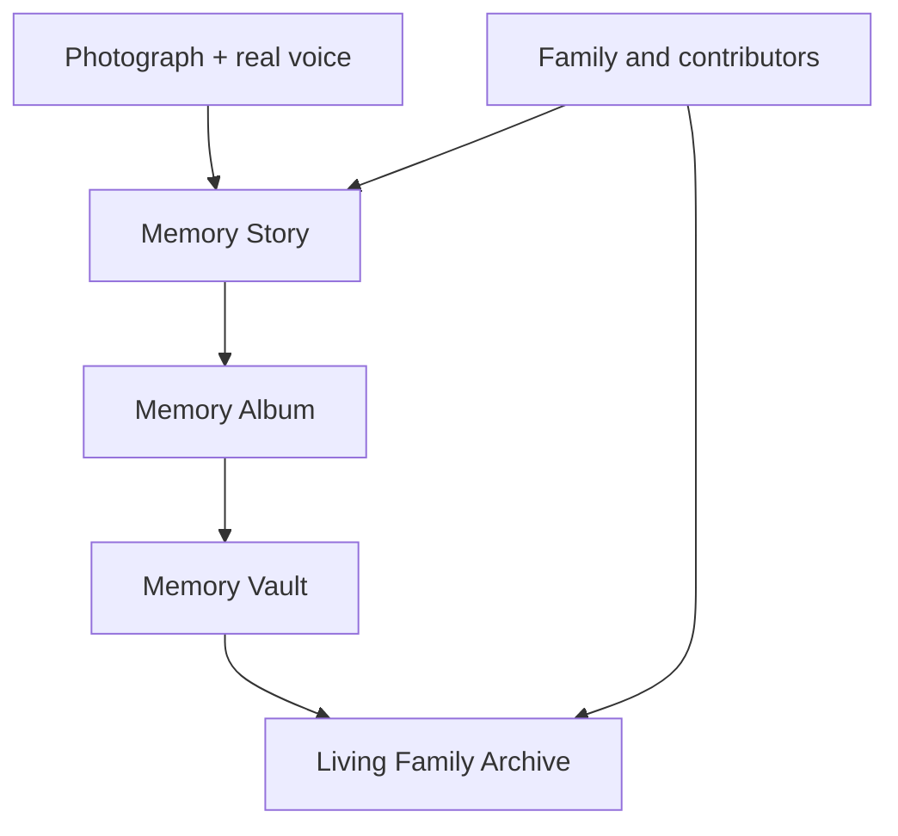

# Core Product Experiences

## 1. Capture Your Memories — Solo

One person captures or imports a photograph, tells the story in their own voice, receives optional warm prompts, reviews the assembled Memory Story, and durably saves it.

This is the first build target and the prerequisite for every shared experience.

## 2. Preserve Together — In Person

Two or more people sit together around a photograph. The product records the natural conversation, attributes contributions when reliable, preserves differing recollections, and assembles one shared Memory Story.

## 3. Remember Together — At a Distance

A host invites family or friends to a remote Memory Circle. The photograph stays central while participants see one another, remember together, review their contributions, and receive the completed Memory Story in their own accounts.

## The archive progression

## Shared completion rule

A completed remote Memory Story should appear in each participant's account after minimal signup. The archive owner controls the primary record; participants retain attribution and receive access to open and share the completed story.
