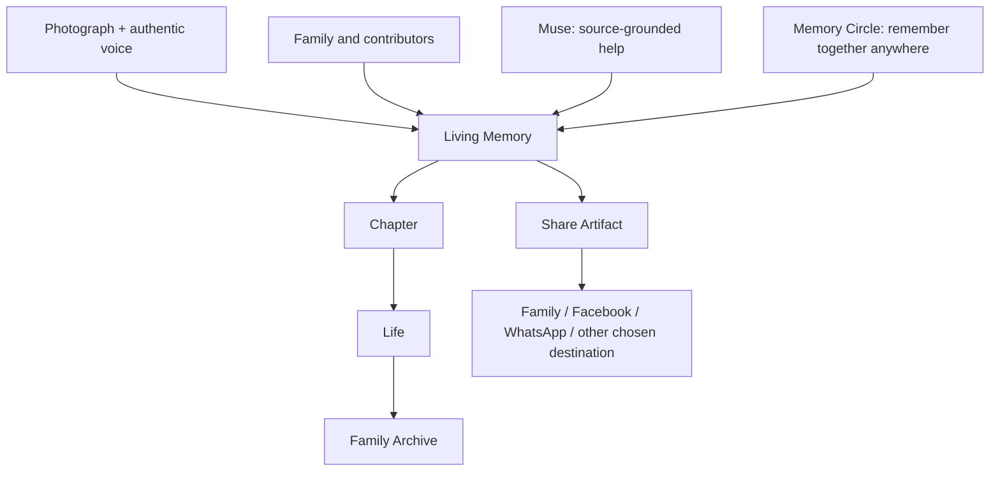

# Core Product Experiences

## 1. Capture Your Memories — Solo

One person captures or imports a photograph, tells the story in their authentic voice, receives optional warm Muse help, and experiences the photograph transformed into a **Living Memory**.

The first complete path is:

**Photo → Voice → Muse → Preserved → Playback → Invite/Share**

The product-level activation event is `first_living_memory_completed`.

Every new customer may experience one complete Living Memory free as the Magic Moment before the paid Chapter / Life / Family offer is the primary next commercial action.

This is the first build target and the prerequisite for every shared or generative experience.

## 2. Memory Circle — Remember Together Anywhere

A **Memory Circle** is the shared act of remembering around one photograph or Living Memory.

Participants may be:

- sitting together in the same room;
- joining live from different homes, cities, or countries;
- participating in a hybrid gathering;
- adding an attributed recollection later when they could not attend live.

The photograph remains the visual anchor while people see and hear one another when remote, tell the story, react naturally, ask questions, identify people, clarify places and dates, laugh, remember differently, and contribute related memories.

The product should preserve **the moment of telling the photograph's story**, not merely produce a cleaned-up final summary. With clear consent, the source conversation can preserve authentic voices, attribution, questions, corrections, pauses, emotion, differing recollections, and newly surfaced context.

Muse stays quiet unless useful. It may surface a thoughtful question or help organize the source after the gathering, but it must not dominate the conversation or manufacture consensus.

Live Memory Circle is included in the **Life** and **Family** commercial levels. Chapter may support simpler asynchronous contribution invitations without becoming a live collaboration tier.

See `MEMORY_CIRCLE_DEFINITION.md` for the canonical experience contract.

## 3. Family Contributions — Enrich Without Overwriting

A family member or friend can contribute to an existing Living Memory according to permission and consent. Contributions remain attributable and additive.

One recollection does not overwrite another. A family may preserve, for example, that one person remembers 1974 while another remembers 1975 and an inscription suggests June 1975.

## 4. Rediscover — Across Time

A person returns through people, places, dates, Chapters, relationships, related memories, anniversaries, and respectful resurfacing. The goal is not manufactured engagement; it is helping meaningful memories participate in family life again.

## The archive progression

## Sharing experience

A Living Memory begins private. When the creator chooses to share, Memories: My Story prepares a bounded **Share Artifact** from selected material rather than exposing the private archive object.

The initial distribution priorities are Facebook for public social sharing and WhatsApp for family-to-family sharing. Sharing never grants another free Living Memory.

## Shared completion rule

A completed collaborative Living Memory remains attributable to its contributors. The archive owner controls the assembled archive according to permissions; contributors retain attribution for their own testimony and receive access according to the participation and sharing contract.
