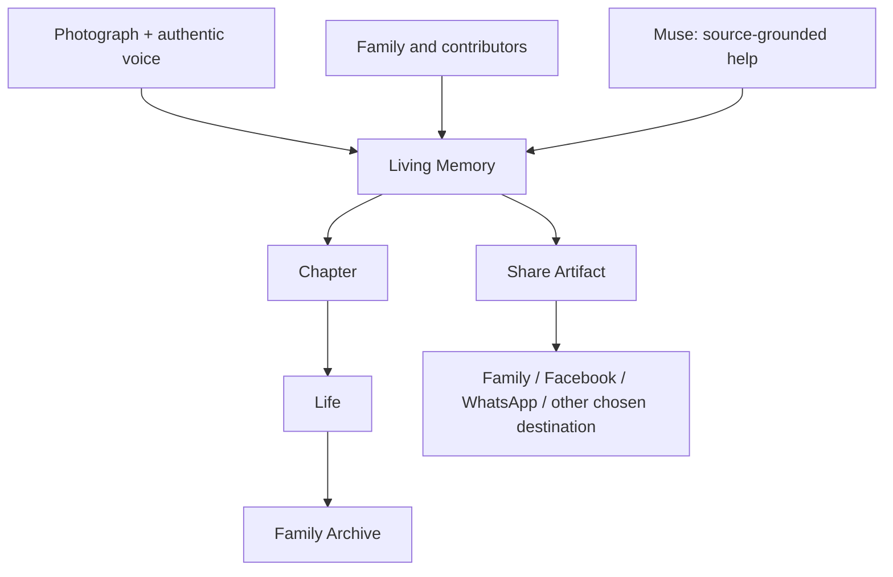

# Core Product Experiences

## 1. Capture Your Memories — Solo

One person captures or imports a photograph, tells the story in their authentic voice, receives optional warm Muse help, and experiences the photograph transformed into a **Living Memory**.

The first complete path is:

**Photo → Voice → Muse → Preserved → Playback → Invite/Share**

The product-level activation event is `first_living_memory_completed`.

This is the first build target and the prerequisite for every shared or generative experience.

## 2. Preserve Together — In Person

Two or more people sit together around a photograph or Living Memory. The product records the natural conversation, attributes contributions when reliable, preserves differing recollections, and enriches the same Living Memory without erasing prior source history.

## 3. Remember Together — At a Distance

A host invites family or friends to a remote **Memory Circle**. The photograph stays central while participants see one another, remember together, review their contributions, and receive appropriate access to the enriched Living Memory.

## 4. Rediscover — Across time

A person returns through people, places, dates, Chapters, relationships, related memories, anniversaries, and respectful resurfacing. The goal is not manufactured engagement; it is helping meaningful memories participate in family life again.

## The archive progression

## Sharing experience

A Living Memory begins private. When the creator chooses to share, Memories: My Story prepares a bounded **Share Artifact** from selected material rather than exposing the private archive object.

The initial distribution priorities are Facebook for public social sharing and WhatsApp for family-to-family sharing. Sharing never grants another free Living Memory.

## Shared completion rule

A completed collaborative Living Memory remains attributable to its contributors. The archive owner controls the assembled archive according to permissions; contributors retain attribution for their own testimony and receive access according to the participation and sharing contract.
